  

 Construindo soluções reais com foco em Ads Tech e Tracking. 
 Apaixonado por infra moderna, edge computing e resolver problemas que importam.

  
  &nbsp;
  
  &nbsp;
  

---

### Sobre mim

- 🚀 Construindo landing pages e apps com **React + TypeScript** deployados na **Cloudflare**
- ☁️ Explorando o ecossistema Cloudflare: Workers, D1, R2, KV
- 🔐 Interessado em Segurança e IA aplicada
- 🎸 Quando não estou codando: guitarra, xadrez ou com a família

---

### Stack

**Frontend & Linguagens**

**Estilização & UI**

**Infra & Deploy**

---

### Projetos

| Projeto | Stack | O que é |
|---|---|---|
| 🏪 **[Salon Sisters](https://salonsisters.com.br)** | React · TS · Tailwind · Cloudflare | Landing page de alta conversão para salão de beleza |
| 🚀 **[Agência Volk](https://consultorluizg.com.br)** | React · TS · Framer Motion · Cloudflare | Site comercial para agência de tráfego e performance digital |
| 🗺️ **[Cities List](https://github.com/lg-pereira/cities_list)** | Python · Streamlit · TravelTime API | Consulta cidades por tempo de deslocamento real, não distância |

---

### 📊 GitHub Stats

  
   
  
    
  

---

### 🐍 GitHub Snake

  <picture>
    <source media="(prefers-color-scheme: dark)" srcset="https://raw.githubusercontent.com/lg-pereira/lg-pereira/output/github-snake-dark.svg" />
    <source media="(prefers-color-scheme: light)" srcset="https://raw.githubusercontent.com/lg-pereira/lg-pereira/output/github-snake.svg" />
    
  </picture>

---

### 👁 Profile Views

  

---

### 🔗 Connect with Me

  
  &nbsp;
  
  &nbsp;
  
  &nbsp;
  

  💻 Always open to collaborating on exciting <strong>AI, ML, or Cloud-based projects</strong>. Let's innovate together!

